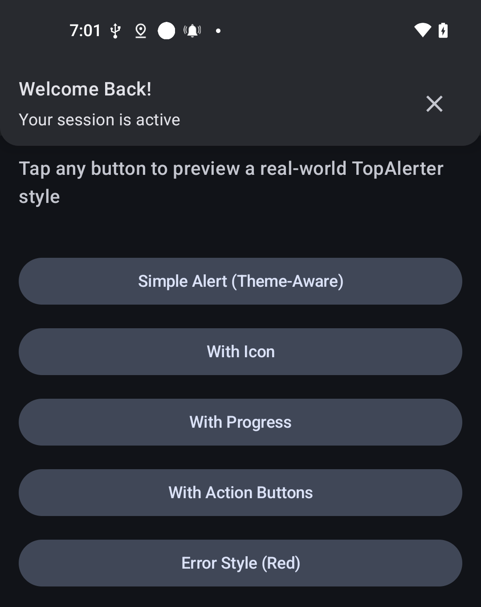
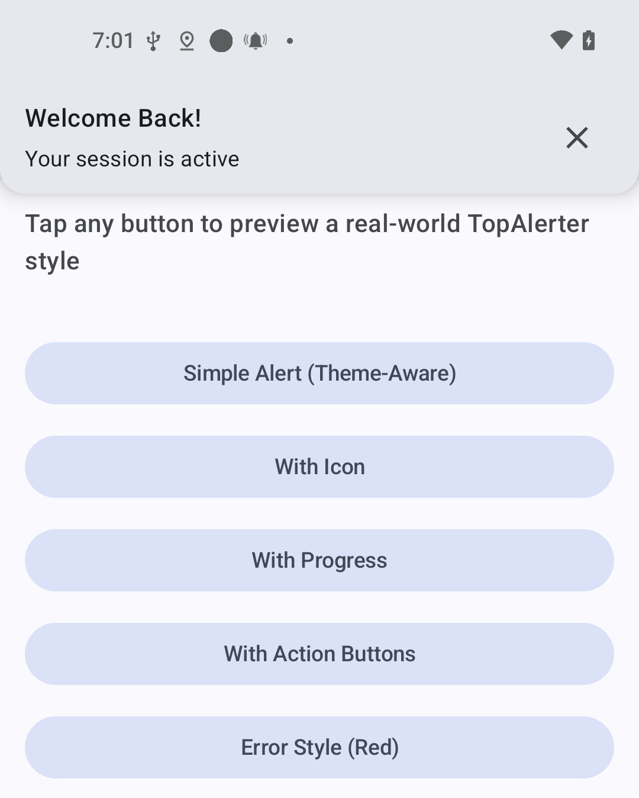
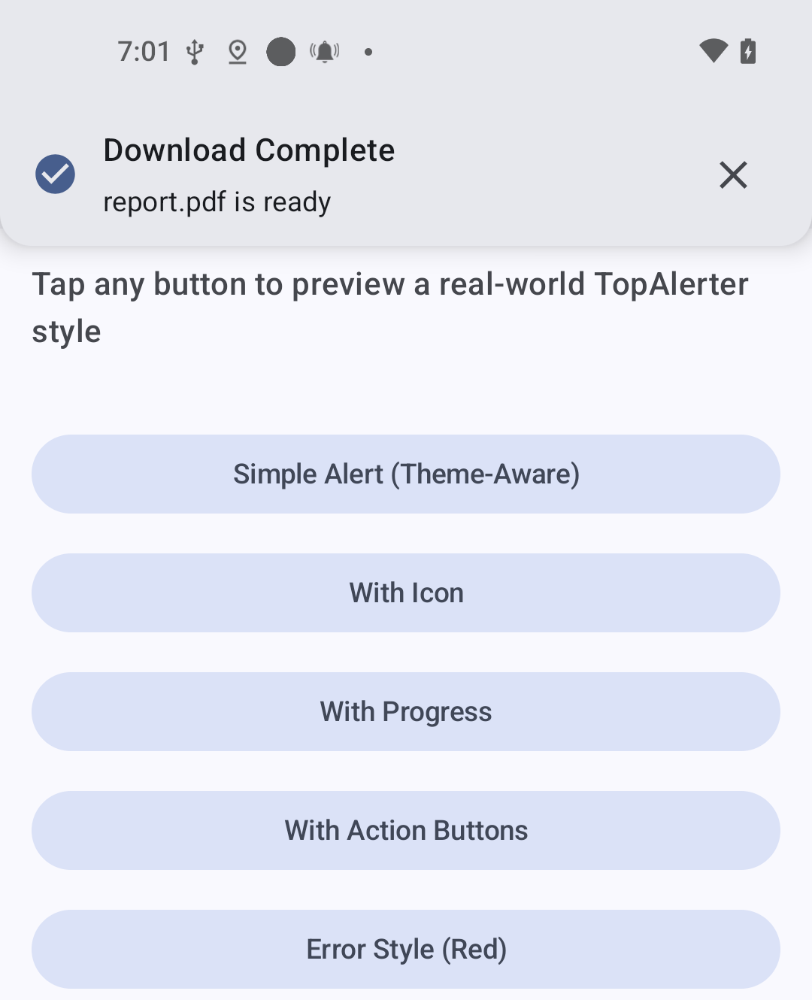
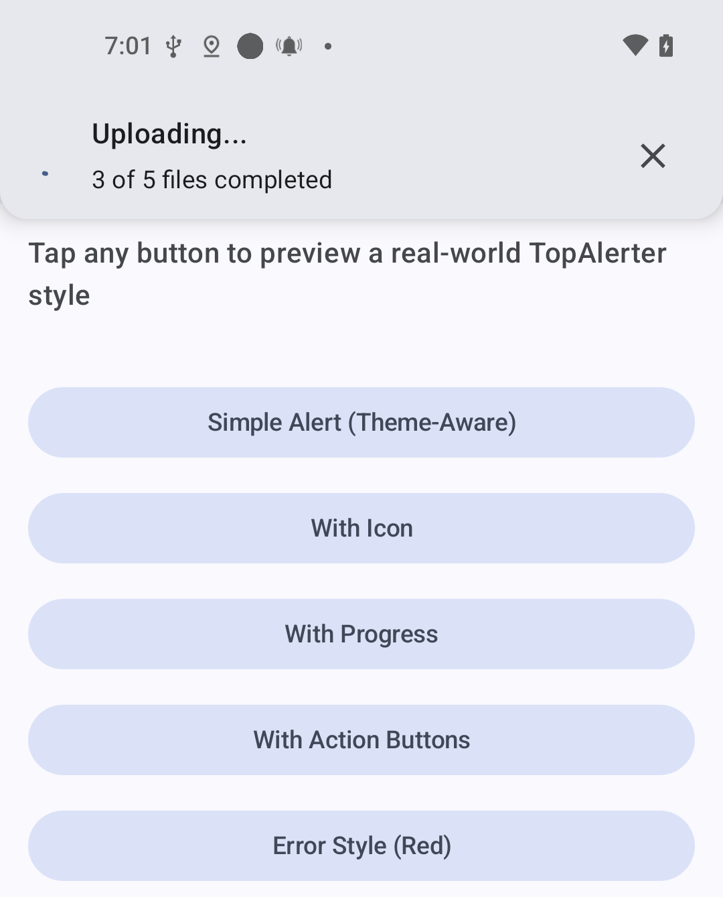
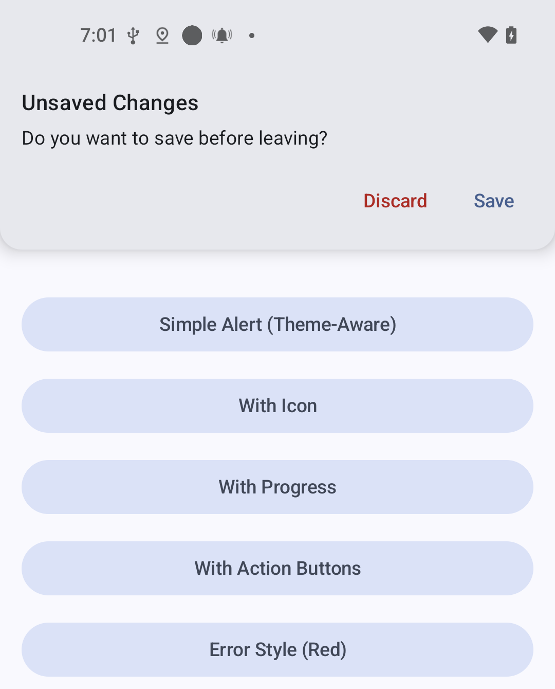
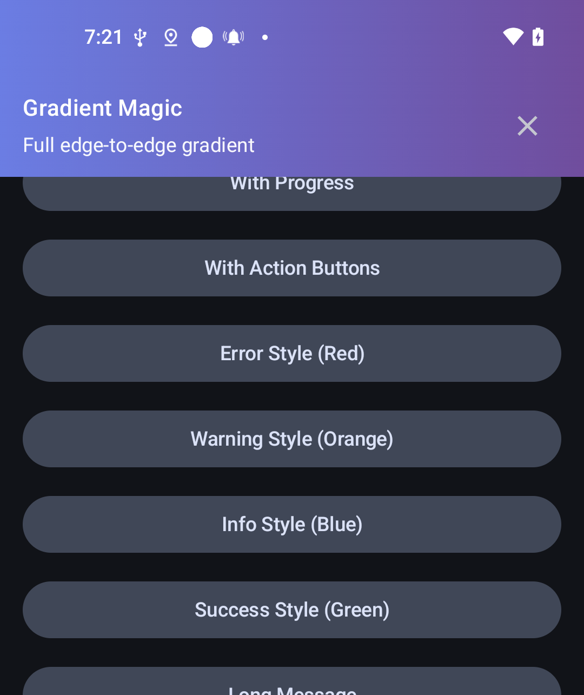
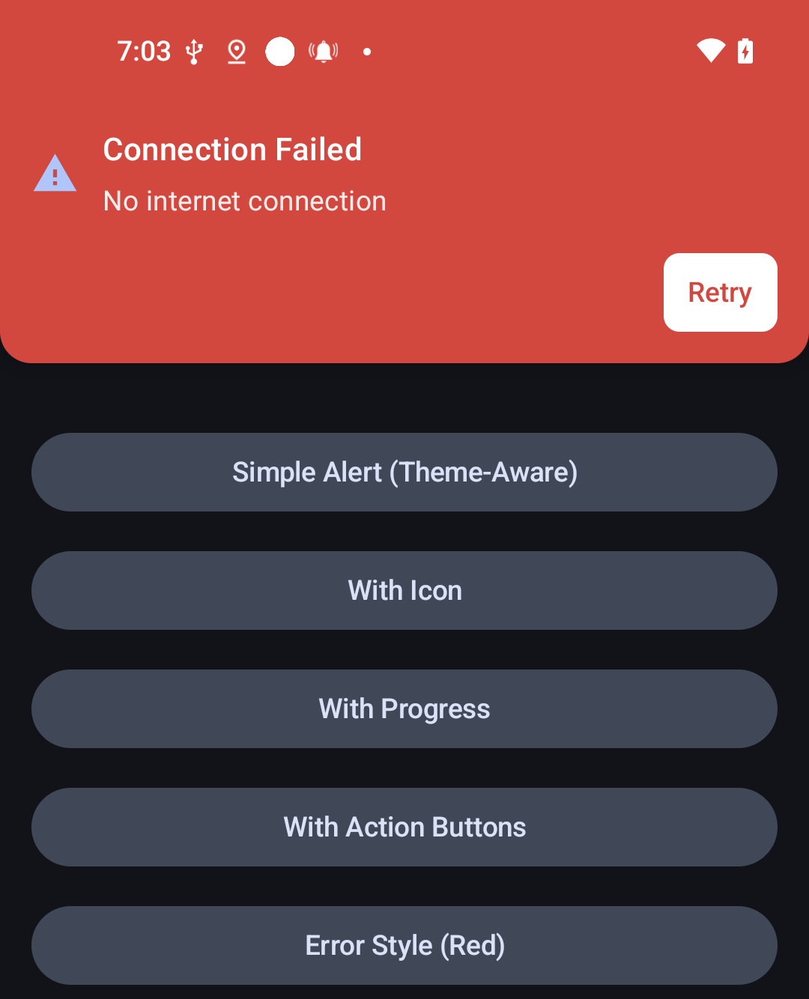
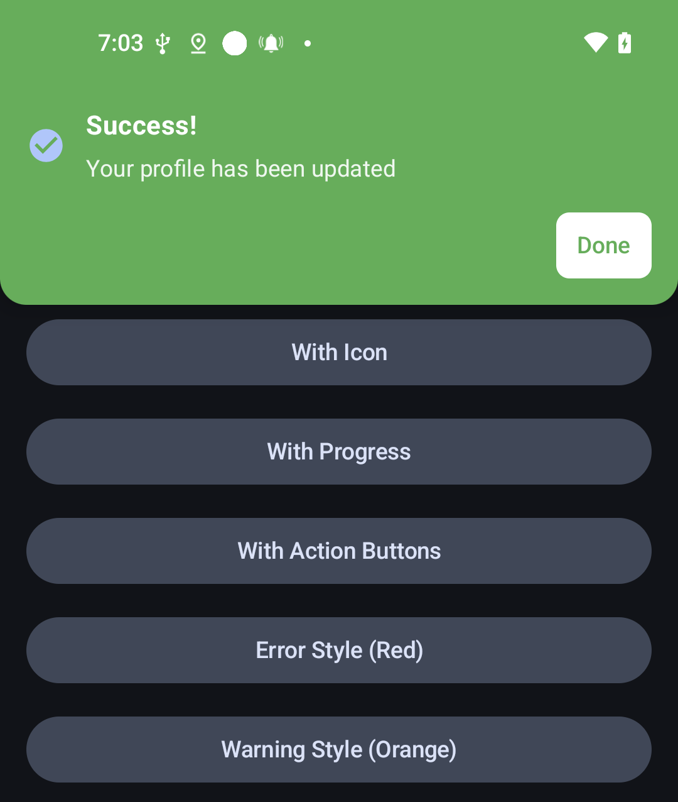
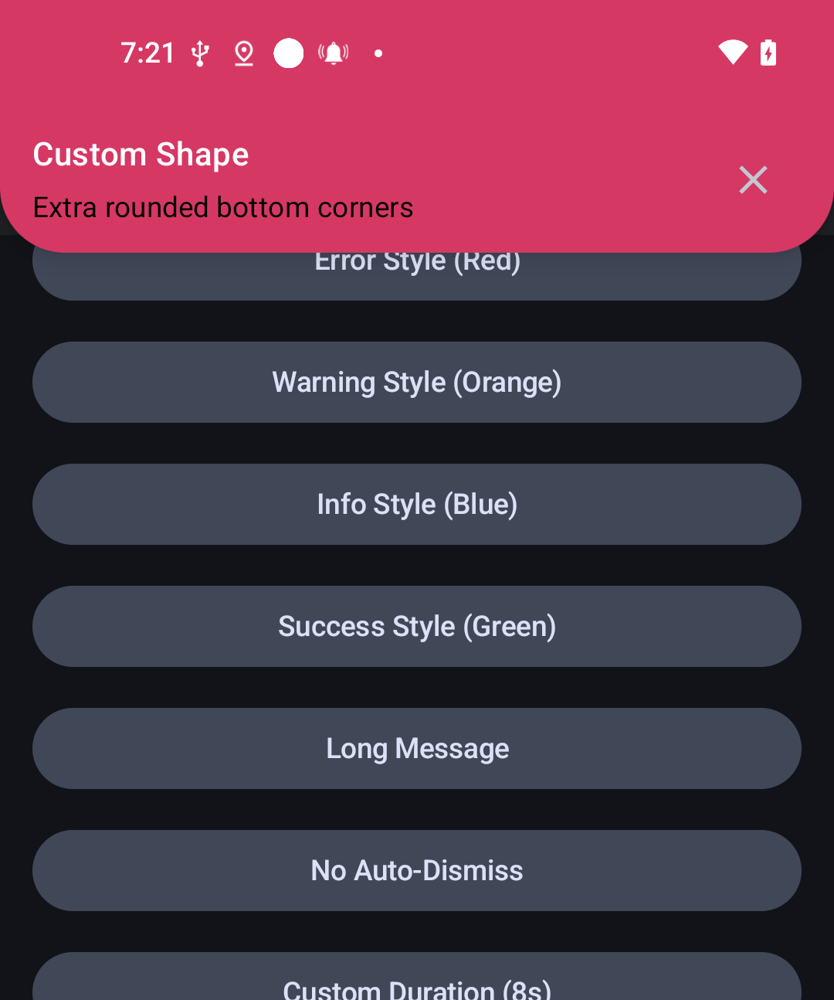

# TopAlerter — Modern Material 3 Top Alert for Jetpack Compose

A polished, fully customizable top alert component for Jetpack Compose. TopAlerter provides a smooth, toast-style banner notification that slides in from the top with fade + slide animations, supports full Material 3 theming, action buttons, progress indicator mode, custom backgrounds, and automatic dismissal.

Ideal for showing success, error, info, warnings, offline states, queued actions, or in-app announcements.

---

## ✨ Features
- Smooth slide + fade in/out animations.
- Material 3 compliant (Typography, Shapes, Color Scheme).
- Theme-aware background using `Color.Unspecified`.
- Transparent mode enabling gradients.
- Optional title, message, and leading icon.
- Replace icon with an indeterminate progress indicator.
- Positive & negative action buttons with full customization.
- Custom shapes, colors, typography.
- Tap-to-dismiss & callback support.
- Auto-dismiss with configurable duration.

---

## 📦 Installation

Add jitpack in `settings.gradle.kts`

```kotlin
pluginManagement {
    repositories {
        google()
        mavenCentral()
        gradlePluginPortal()
        maven("https://jitpack.io") // Add JitPack here
    }
}

dependencyResolutionManagement {
    repositoriesMode.set(RepositoriesMode.FAIL_ON_PROJECT_REPOS)
    repositories {
        google()
        mavenCentral()
        maven("https://jitpack.io") // And here for project dependencies
    }
}
```
Add to `libs.versions.toml` in gradle catalog version,
```kotlin
[versions]
topalerter = "RELEASE_VERSION" // specify the version here example 1.0.0

[libraries]
topalerter = { module = "com.github.mflib:topalerter", version.ref = "topalerter" }
```
or add to `build.gradle.kts` directly
```kotlin
dependencies {
    implementation("com.github.mflib:topalerter:<version>")
}
```
---


## 🚀 Example usage.

```kotlin
var visible by remember { mutableStateOf(true) }

TopAlerter(
    visible = visible,
    title = "Success",
    message = "Your profile has been updated",
    onDismiss = { visible = false }
)
```

---

## 🎨 With Icon

```kotlin
TopAlerter(
    visible = visible,
    title = "Success",
    message = "Your profile has been updated",
    icon = Icons.Default.CheckCircle,
    onDismiss = { visible = false }
)
```

## 🎨 With Circular ProgressBar

```kotlin
TopAlerter(
    visible = visible,
    title = "Uploading....",
    message = "3 of 5 files completed",
    showProgress = true,
    icon = Icons.Default.CheckCircle,
    onDismiss = { visible = false }
)
```

## 🎨 With Action Buttons

```kotlin
TopAlerter(
    visible = true,
    title = "Unsaved Changes",
    message = "Do you want to save before leaving?",
    positiveButtonText = "Save",
    positiveButtonOnClick = { /* save logic */ },
    negativeButtonText = "Discard",
    negativeButtonColors = ButtonDefaults.textButtonColors(
        contentColor = MaterialTheme.colorScheme.error
    ),
    onDismiss = { states[3] = false }
)
```

## 🎨 Error Styled

```kotlin
TopAlerter(
    visible = true,
    title = "Connection Failed",
    message = "No internet connection",
    icon = Icons.Default.Warning,
    backgroundColor = Color(0xFFE53935),
    titleColor = Color.White,
    messageColor = Color.White.copy(0.9f),
    iconTint = Color.White,
    positiveButtonText = "Retry",
    positiveButtonColors = ButtonDefaults.buttonColors(
        containerColor = Color.White,
        contentColor = Color(0xFFE53935)
    ),
    onDismiss = { states[4] = false }
)
```

## 🎨 Warning Styled

```kotlin
TopAlerter(
    visible = true,
    title = "Low Battery",
    message = "15% remaining – plug in soon",
    icon = Icons.Default.BatteryAlert,
    backgroundColor = Color(0xFFFF9800),
    titleColor = Color.White,
    iconTint = Color.White,
    onDismiss = { states[5] = false }
)
```


## 🎨 Custom Background (Gradient Example)

```kotlin
TopAlerter(
    visible = visible,
    backgroundColor = Color.Transparent,
    modifier = Modifier.background(
        Brush.linearGradient(
            listOf(Color(0xFF4481EB), Color(0xFF04BEFE))
        )
    ),
    title = "Connected",
    message = "You are back online",
    icon = Icons.Default.Wifi,
)
```

---

## 🧩 Parameters Overview

Below is a complete set of all parameters neatly organized in tables.

### 📘 Core
| Parameter | Type | Description |
|----------|------|-------------|
| `modifier` | Modifier | Applies padding, background, click effects, etc. |
| `visible` | Boolean | Controls visibility and triggers animations |
| `title` | String? | Main bold title text; nullable |
| `message` | String? | Supporting message; nullable |
| `icon` | ImageVector? | Leading icon; nullable |

### 🎨 Appearance
| Parameter | Type | Description |
|----------|------|-------------|
| `backgroundColor` | Color | Uses theme surface if `Unspecified`; transparent enables full custom backgrounds |
| `containerShape` | Shape | Shape of the alert container |
| `tonalElevation` | Dp | Elevation when using theme background |

### 📝 Title
| Parameter | Type | Description |
|----------|------|-------------|
| `titleStyle` | TextStyle | Base text style for title |
| `titleColor` | Color | Text color; defaults to `onSurface` if unspecified |
| `titleFontWeight` | FontWeight? | Optional weight override |

### 📝 Message
| Parameter | Type | Description |
|----------|------|-------------|
| `messageStyle` | TextStyle | Base style for message text |
| `messageColor` | Color | Text color; defaults to `onSurfaceVariant` |
| `messageMaxLines` | Int | Maximum visible lines before ellipsis |

### 🔄 Icon / Progress
| Parameter | Type | Description |
|----------|------|-------------|
| `iconTint` | Color | Tint color for icon |
| `showProgress` | Boolean | Shows progress indicator instead of icon |
| `progressColor` | Color | Color of progress indicator |

### ▶️ Positive Action Button
| Parameter | Type | Description |
|----------|------|-------------|
| `positiveButtonText` | String? | Label for primary action button |
| `positiveButtonOnClick` | () -> Unit | Callback on primary action click |
| `positiveButtonColors` | ButtonColors? | Override colors for button |
| `positiveButtonShape` | Shape | Custom button shape |
| `positiveButtonTextStyle` | TextStyle | Text style override |

### ⏸ Negative Action Button
| Parameter | Type | Description |
|----------|------|-------------|
| `negativeButtonText` | String? | Label for secondary action button |
| `negativeButtonOnClick` | () -> Unit | Callback on secondary action click |
| `negativeButtonColors` | ButtonColors? | Override colors |
| `negativeButtonShape` | Shape | Custom button shape |
| `negativeButtonTextStyle` | TextStyle | Text style override |

### ⚙️ Behavior
| Parameter | Type | Description |
|----------|------|-------------|
| `durationMillis` | Long | Auto-dismiss duration |
| `autoDismiss` | Boolean | Enables timed auto-dismiss |
| `onClick` | () -> Unit? | Called when entire alert is tapped |
| `onDismiss` | () -> Unit | Called when alert is dismissed |


---

## 🧪 Demo Previews
<p align="center">
  
  
  
</p>

<p align="center">
  
  
   
</p>

<p align="center">
  
  
    
</p>


## 🤝 Contributing
Contributions, issue reports, and feature requests are welcome! Feel free to open a PR or discussion.
---

## 📄 License
#### This project is licensed under the **Apache License 2.0**. You may obtain a copy of the license here: [http://www.apache.org/licenses/LICENSE-2.0](http://www.apache.org/licenses/LICENSE-2.0)
---
